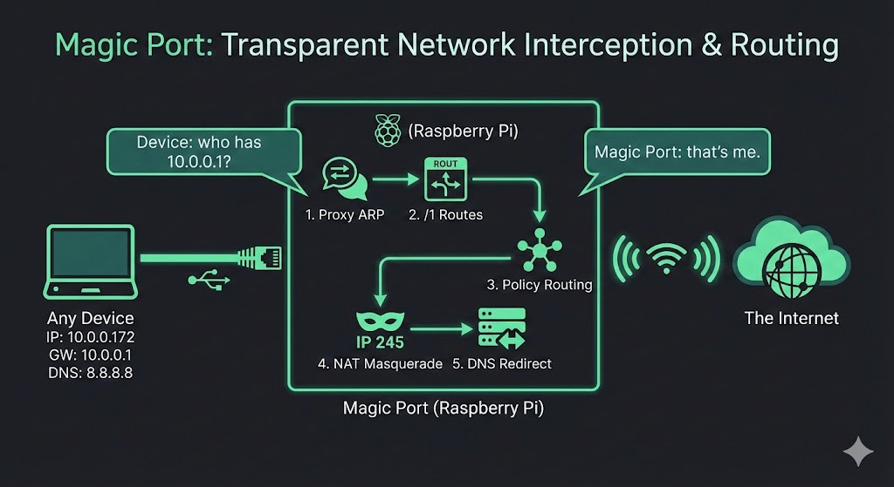
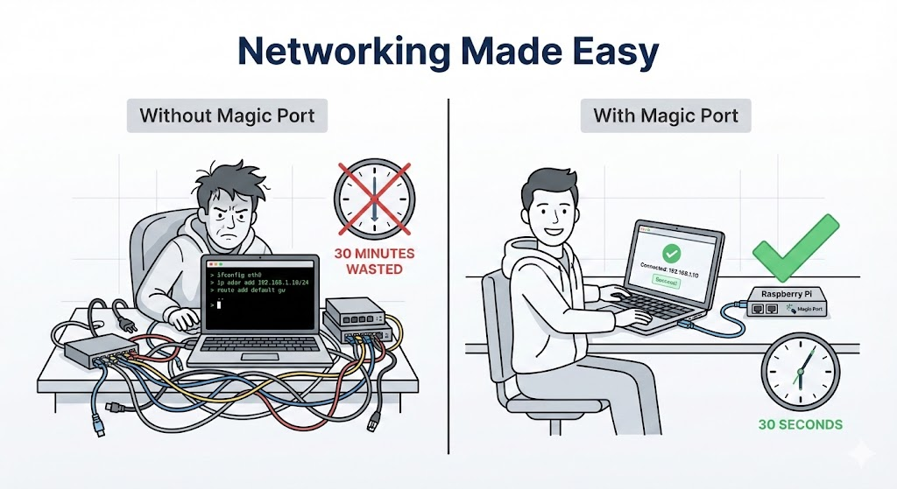
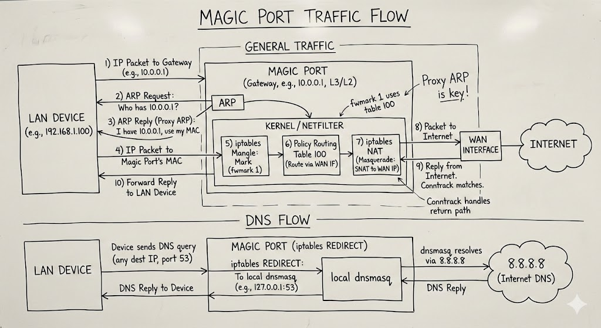
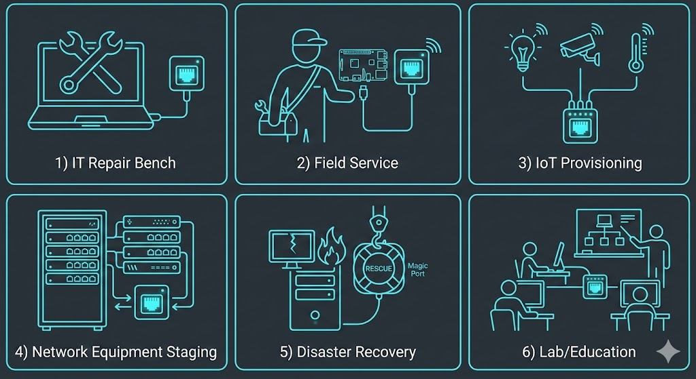

# Magic Port

Plug in any device, it has internet. Doesn't matter what IP it's configured for.

A bash script that turns a Linux box with two network interfaces into a transparent gateway. Device has a static IP for some network you're not on? Plug it in. DHCP? Plug it in. Link-local? Plug it in. No changes needed on the device side.

> **Magic Port is designed to run on a dedicated device** (like a Raspberry Pi). It takes full control of networking, firewalls, and DNS. Don't install it on a machine that does other things.



## Why

You've got a device configured for `10.0.0.172/24` pointing at gateway `10.0.0.1`. You're not on that network. You need to give it internet access without touching its config.

Normally you'd spend 30 minutes figuring out its IP scheme, reconfiguring your network to match, setting up routes... or you just plug it into a Magic Port and it works.



## Quick Start

```bash
sudo cp gateway-mode /usr/local/bin/gateway-mode
sudo chmod +x /usr/local/bin/gateway-mode

# That's it. Dependencies install themselves on first run.
sudo gateway-mode on

# Plug in a device. Done.
sudo gateway-mode status
sudo gateway-mode off
```

### Raspberry Pi (WiFi as WAN)

```bash
sudo gateway-mode wifi list
sudo gateway-mode wifi "MyNetwork"    # prompts for passphrase
sudo gateway-mode on
# Ethernet port is now the magic port
```

## How It Works



1. **`/1` routes** -- Two addresses (`10.255.0.1/1` + `128.0.0.1/1`) cover the entire IPv4 space. The kernel treats every IP as on-link for the LAN interface.

2. **Proxy ARP** -- Device asks "who has 10.0.0.1?" (its gateway). Magic Port replies "that's me." Device sends traffic here without knowing the difference.

3. **Fwmark + policy routing** -- LAN traffic gets marked and routed out the WAN interface via a separate routing table. Prevents the `/1` routes from looping.

4. **NAT masquerade** -- Standard source NAT on the WAN side.

5. **DNS redirect** -- All DNS queries get intercepted and handled locally, since the device's configured DNS server is unreachable.

6. **DHCP** -- Devices without a static IP get an address automatically.

## Use Cases



- **Repair bench** -- Laptop comes in configured for a corporate network. Don't know the config, can't change it. Plug it in, run updates.
- **Field service** -- Pi in your bag, connect WiFi to a hotspot, plug in the customer's gear. Instant connectivity.
- **IoT provisioning** -- Devices ship with hardcoded IPs all over the map. Plug them in one at a time, update firmware.
- **Equipment staging** -- Routers and switches pre-configured for customer networks need a firmware update before shipping.
- **Disaster recovery** -- Pull a server from a dead site, plug it into a bench somewhere else. Works immediately.

## Tested On

Raspberry Pi 3 Model B, **Pi OS Lite (64-bit)** (Debian Trixie).
## What It Handles

The script deals with the stuff that breaks on fresh installs so you don't have to:

- Auto-installs missing packages (`iptables`, `dnsmasq-base`, `iproute2`)
- Stops `systemd-resolved` if it's hogging port 53 (restores it on `off`)
- Tells NetworkManager / dhcpcd to leave the LAN interface alone
- Disables `ufw` / `firewalld` if they're in the way
- Skips `proxy_arp_pvlan` gracefully if the kernel doesn't support it
- Portable -- uses `sed` instead of GNU-only `grep -oP`

## Configuration

Top of the script:

```bash
LAN_IF="auto"          # or hardcode e.g. "eth0"
WAN_IF="auto"          # or "wlan0"
LAN_RESTORE_IP="192.168.1.1/24"
DHCP_RANGE_START="10.255.0.100"
DHCP_RANGE_END="10.255.0.200"
DNS_PRIMARY="8.8.8.8"  # upstream DNS for forwarding
DNS_SECONDARY="8.8.4.4"
```

Auto-detect picks WiFi as WAN if connected, first ethernet as LAN.

## Requirements

- Linux with two network interfaces
- WAN side has internet (WiFi, ethernet, cellular, whatever)
- `iptables`, `dnsmasq`, `iproute2` (auto-installed)
- For WiFi: NetworkManager (`nmcli`)

## Limitations

- IPv4 only
- One device at a time (multiple work if IPs don't conflict, but no isolation)
- Outbound NAT only -- no inbound access
- WAN needs a default route
- First-run package install needs internet on the WAN side

## Alternatives and Why They Don't Work Here

| | |
|---|---|
| **NAT router / travel router** | Only works if the device DHCPs from it. Static IPs? No luck. |
| **Bridge** | L2 only -- doesn't solve L3 routing. Device still can't reach its gateway. |
| **VPN / USB tethering** | Requires software or config changes on the device. |
